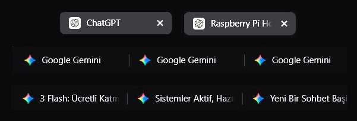

  
  
  
  

  <a href="README.md">English</a> · <a href="https://github.com/ahseyg/auto-tab-renamer/issues">Hata Bildir</a>

  

# Auto Tab Renamer

**Çok fazla sekmeniz mi açık?** Başlıklar yetersiz olduğu veya kesildiği için sekmelerinizi ayırt etmekte zorlanıyor musunuz?
**Auto Tab Renamer**, sekmelerinizi sayfa içeriğine göre otomatik olarak yeniden adlandırarak bu sorunu çözer. Sekmelerinizi her zaman kolayca tanımanızı sağlayarak iş akışınızı ve düzeninizi iyileştirir.

**Açık kaynak** · MIT Lisansı · Katkılara açık

---

## Özellikler

- **Dinamik Yeniden Adlandırma** — Sekme başlıklarını DOM içeriğine göre otomatik olarak günceller
- **CSS Seçicileri** — Standart CSS seçicilerini kullanarak herhangi bir elementten başlık bilgisi çeker
- **Özelleştirilebilir Kurallar** — Regex URL eşleşmesi ile her site için özel kurallar oluşturun
- **Otomatik Doldurma** — Tek tıklama ile mevcut sekmeden hızlıca kural oluşturun
- **Hazır Destek** — ChatGPT ve Google Gemini için önceden yapılandırılmış kurallar içerir
- **Dikey Sekme Optimizasyonu** — Zen Browser gibi dikey sekme yapısına sahip tarayıcılar için optimize edilmiştir

---

## Ekran Görüntüleri

### Eklenti Arayüzü

---

## Kurulum

### Chrome / Edge / Brave

1. Bu depoyu indirin veya klonlayın
2. `chrome://extensions/` adresine gidin
3. Sağ üst köşedeki "Geliştirici modu"nu etkinleştirin
4. "Paketlenmemiş öğe yükle" seçeneğine tıklayın ve `auto-tab-renamer` ana klasörünü seçin

> **ℹ️ Yakında Chrome Web Mağazası'nda**

### Firefox / Zen Browser

1. `about:debugging#/runtime/this-firefox` adresine gidin
2. "Geçici Eklenti Yükle..." düğmesine tıklayın
3. `manifest.json` dosyasını seçin

> **ℹ️ Yakında Firefox Eklentileri'nde**

---

## Kullanım

1. Araç çubuğundaki eklenti simgesine tıklayın
2. **"Add Rule"** (Kural Ekle) seçeneğini seçin
3. URL desenini otomatik doldurmak için **"Auto-Fill"** (Otomatik Doldur) düğmesini kullanın
4. Hedef başlık elementi için geçerli **CSS Seçicisini** girin
5. Kuralı kaydedin

---

## Katkıda Bulunma

- **Hata bildirimi:** [Sorun açın](https://github.com/ahseyg/auto-tab-renamer/issues)
- **Özellik isteği:** [Sorun açın](https://github.com/ahseyg/auto-tab-renamer/issues)
- **Pull request:** Fork → Branch → Kod → PR

Eklentiyi faydalı buluyorsanız bir [yıldız](https://github.com/ahseyg/auto-tab-renamer) bırakmayı düşünün.

---

## Lisans

MIT — Detaylar için [LICENSE](../LICENSE) dosyasına bakın.

---

  Geliştirici: <a href="https://github.com/ahseyg">ahseyg</a>

